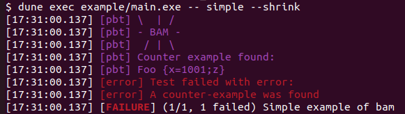

# Bam - Property-Based Testing Library for OCaml

## Overview

Bam is an OCaml library designed for property-based testing (PBT).
Property-based testing is a methodology where properties are verified
across numerous randomly generated values. When a counterexample is
found, a shrinker can be employed to produce smaller, more
comprehensible counterexamples, thus facilitating easier debugging.

## Key Features

- **Monad-like Generators**: The library facilitates the easy creation of
  new generators, adhering to a monad-like pattern that works
  seamlessly with shrinking mechanisms.

- **Standard Library**: The Std module includes basic generators
  equipped with multiple shrinking strategies. The modularity of the
  monad-like generators makes it straightforward to develop custom
  generators for your types.

- **PPX support**: Automatically derives generators based on type
    description. The deriver is customizable to ensure smooth
    integration into your codebase.

- **Tezt Integration**: Features integration with the
    [Tezt](https://gitlab.com/nomadic-labs/tezt) test framework,
    aiming to provide a user-friendly experience, especially notable
    in debugging scenarios

- **Internal shrinking**: Offers various default shrinking strategies
    that help efficiently pinpoint minimal counterexamples. Each
    strategy is "internal," ensuring that shrinking processes do not
    generate new values, only smaller iterations of the original
    values.

- **Custom Shrinking**: The library supports the definition of custom
  shrinkers that combine well with the already shrinking strategies

- **Documentation on Shrinking**: A detailed primer on the intricacies
  of shrinking within this library is available for those interested
  in deepening their understanding. Access it
  [here](https://francoisthire.github.io/bam/bam/shrinking.html).

## Installation

### With opam

```bash
opam install bam tezt-bam
```

Compatibility is ensured for OCaml versions `4.14.2`, `5.0.0` and
`5.1.0`.

The library and its examples rely on the `dune` build system.  If `dune`
is not already available on your machine, install it with opam and
refresh your environment:

```bash
opam install dune
eval $(opam env)
```

## Usage

A simple test can be run as follows:

```ocaml
open Tezt_bam


type t = Foo of {a: int; b : string} | Bar of int list[@@deriving gen]
(** The deriver creates a value [val gen : t Bam.Std.t]. *)

let register () =
  let property = function
  | Foo {a; b} ->
      if a > 1_000 && String.contains b 'z' then
        Error (`Fail "A counter-example was found")
      else Ok ()
  | Bar [1; 2; 3; 4] ->
      Error `Bad_value
  | Bar _ ->
      Ok ()
  in  
  Pbt.register ~__FILE__ ~title:"Simple example of bam" ~tags:["bam"; "simple"]
    ~gen ~property ()

let _ = 
    register ();
    Test.run ()
```




or without using the PPX deriver, the same example could be written as follows:

```ocaml
open Tezt_bam


type t = Foo of {a: int; b : string} | Bar of int list

let gen =
  let open Bam.Std.Syntax in
  let gen_Foo =
    let* a = Bam.Std.int () in
    let* b = Bam.Std.string ~size:(Bam.Std.int ~max:10 ()) () in
    return (Foo {a; b})
  in
  let gen_Bar =
    let* arg_0 =      
      Bam.Std.list ~size:(Bam.Std.int ~max:10 ()) (Bam.Std.int ())
    in
    return (Bar arg_0)
  in
  Bam.Std.oneof [(1, gen_Foo); (1, gen_Bar)]

let register () =  
  let property = function
  | Foo {a; b} ->
      if a > 1_000 && String.contains b 'z' then
        Error (`Fail "A counter-example was found")
      else Ok ()
  | Bar [1; 2; 3; 4] ->
      Error `Bad_value
  | Bar _ ->
      Ok ()
  in  
  Pbt.register ~__FILE__ ~title:"Simple example of bam" ~tags:["bam"; "simple"]
    ~gen ~property ()

let _ = 
    register ();
    Test.run ()
```

This example and how it can be run are explained through the various
[examples](https://github.com/francoisthire/bam/tree/master/example). We invite
you to read them if you are interested in starting with the library!

## PPX

At the moment, the PPX support is partial but should cover a vast majority of
use cases. Moreover, the deriver supports many attributes to tune its behavior.
In particular, one can specify a generator when it is not supported by the
deriver.

There is no proper documentation for the PPX yet. Instead, we invite you to look
at the many examples
[here](https://github.com/francoisthire/bam/blob/master/test/ppx.ml) to see what
types are supported and how the deriver can be tuned. 

Contributions are welcome!

## License

[](https://opensource.org/licenses/MIT)
